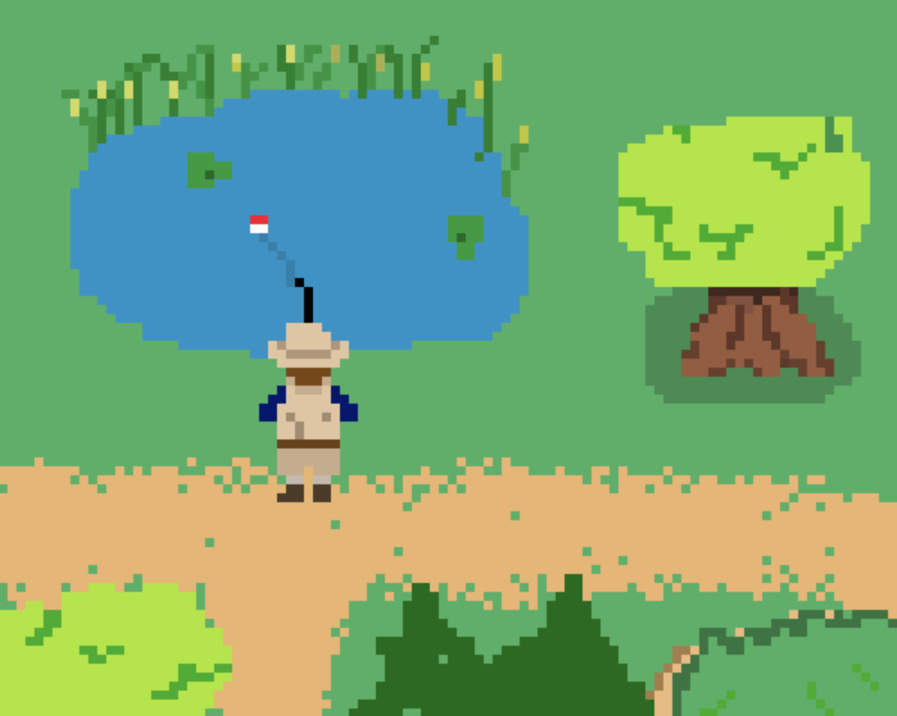
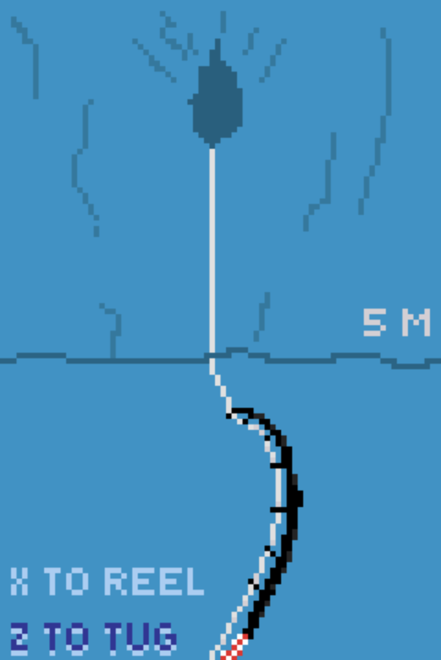

# Fishing Game!

by fishing game

## Team Members
* Advanced Topic Subteam 1: Physics/Fluid Dynamics
	* Cole Metrick
	* Ken Barrett
	* Jason Ye
	* Dheyab Alshehhi

* Advanced Topic Subteam 2: Bayesian Networks
	* Ben Gradeck
	* Jackie Colmenares
	* Apostoli Karpouzis
	* Corey Medve

## Game Description

We are making a top-down Fishing and exploration game. The player will explore the game world looking for new bodies of water to catch fish in. Along the way players will obtain new equiptment, sell their catches for money, and work towards catching the biggest fish they can. The gameplay will have two main Advanced topics to give some realism to the fishing. Fluid Dynamics will simulate casting the bait, using the lure, then dragging the fish in. It will simulate realistic fluic dynamics to give an accurate simulation of fishing. Once a fish is on the line the player will have to sucessfully reel a fish in without the fish snapping the line. The other advanced topic is sophisticated fish AI. There will be a determined number of fish in each water source. The fish in the game will all behave differently depending on species, ex: catfish staying exclusivly at the bottom, or trout only fishing against a streams current. New fish will spawn on a cycle to simulate fish reaching maturity or dying in order to simulate a target population. Enviornmental aspects and lure use will simulate catching fish, better lure use or casting into an ideal location will influence the fish to get hooked more often. 

### Concept Art:

## Advanced Topic Description

### Advanced Physics/Fluid Dynamics

We will create a 3D simulation of body of water to best simulate the real world. There will be waves that are dispered when surface tension is broken and different lures will act differently in the water. The translational and rotational motion of the fish will be calculated based on player actions, fish characteristics, and fishing rod characteristics. Fluid-dynamic drag will factor into the motion. Projectile motion will be incorpoated for lure casting based on the lure weight and rod strength. The tensile strength of the fishing rod and line will be taken into account for visuals and line snapping. For example, the rod will bend more when there is more tension on the line. Environmental factors like water currents and debris will affect tension on the line and increase drag.

### Bayesian Networks (AI)

Our goal with AI is to simulate the existence of how many fish are in the pond, and what types of fish they are, as well as their behavior. We will develop a behavior tree to model the variety of actions for each fish species. The fish behavior will be dependant on how close the lures are, and what kind of bait is in the water, as well as environmental conditions. These fish actions will be passed on to the fluid dynamics team. Depending on how the fish is moving, slowly or quickly, towards or away from the lure, will affect the water movement. The fish behavior will be calculated per frame, and the existance of those fish will be evaluated in a larger scope of the game world. 

## Midterm Goals

### General
* 4x4 grid will be out game world each segment about one screen size(similar to nes zelda)
* 1 different lure types
* 2d top down Player movement for overworld exploration
* Small collection of fish types with basic behavior. At least 2 with probability models.
* Shop system for buying lures and selling off fish
* Simple functional animation to convey gameplay ideas ex: walking, casting, reel moving, fish animations when its moving.
* Basic UI for water physics. for example a lure/fish making water ripple as they move through the water.

### Physics
* Implement 3D simulation of water. 
  * Waves will disperse when surface tension is broken
    * When bait is casted into water
    * When reeling in bait
* We will implement projectile calculation to determine casting distance of lure.

### Bayesian Networks
* Create one fishing environment
  * Defined model for introduction and removal of fish into environment
  * Incorporate time of day and weather into environment's model/fish spawn probability
* Create two different fish types
  * Bayesian network for activity of the fish types
  * Take time of day, water depth, and weather into account for Bayesian networks (with fixed values for each)

## Final Goals

### General (40%)
* Multiple line types (braided, monofilament) (8%)
* 3 different lure types (10%)
* 5x5 game world grid (2%)
* Expanded collection of fish types and behaviors (10%)
* multiple ponds/lakes that have a chance of spawning different fish (5%)
* In water elements affecting spawning such as lily pads in ponds or rocks in water (5%)

### Physics (20%)
* Fishing rod (8%)
  * Line breaking when too much tension is reached
  * Rod bending based on amount of tension on line
* Calculate fish drag force(8%)
  * Physical characteristics
    * Mass
    * Size
    * Shape
  * Motion
    * Velocity
    * Rotation
  * Different lures will act differently in water(4%)
    * Heavier lures will sink and take longer to reel in due to water viscosity 
    * Surface lures will float and create more waves when reeling

### Bayesian Networks (20%)
* 1 different fishing enviroments (5%)
  * Fishing enviroments attempt to maintain a population of fish with fish being added/removed each day 
* 5 different types of fish each with its own behavioral tree(5%)
* Implementation of day/night cycle (5%)
  * Look / lighting in the world changes based off of the time of day
  * The fish able to be caught and the activity of the enviroments differ on the time of day
* Implement weather cycle (5%)
  * Different regions of the map can have different weather at the same time
  * Weather can change throughout the day

## Stretch Goals (10%)

* Add 2 items that enhances the players ability to catch a fish (3%)
  * A pair of polarized glasses to improve the odds of finding fish
  * A new rod to change how the players interacts with the physics
* Add a legendary rarity fish (3%)
  * Much harder to catch and spawns less often than the other fish types
*Debris (2%)
  * increases tension when debris is caught
* wild lures/items to find (2%)
  * makes exploration rewarding by hiding collectable items/better lures in the game world. 

